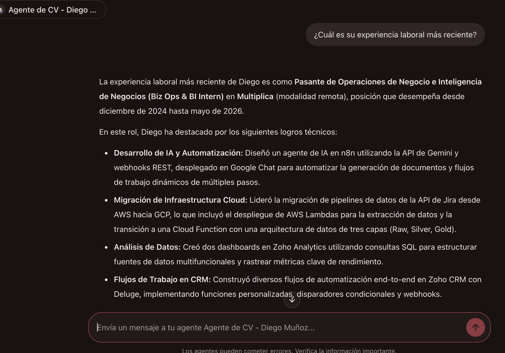
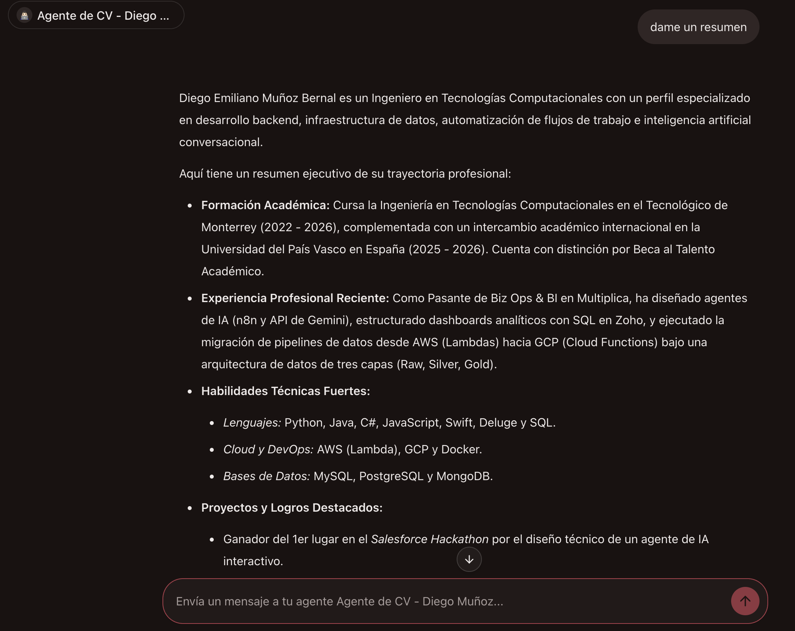
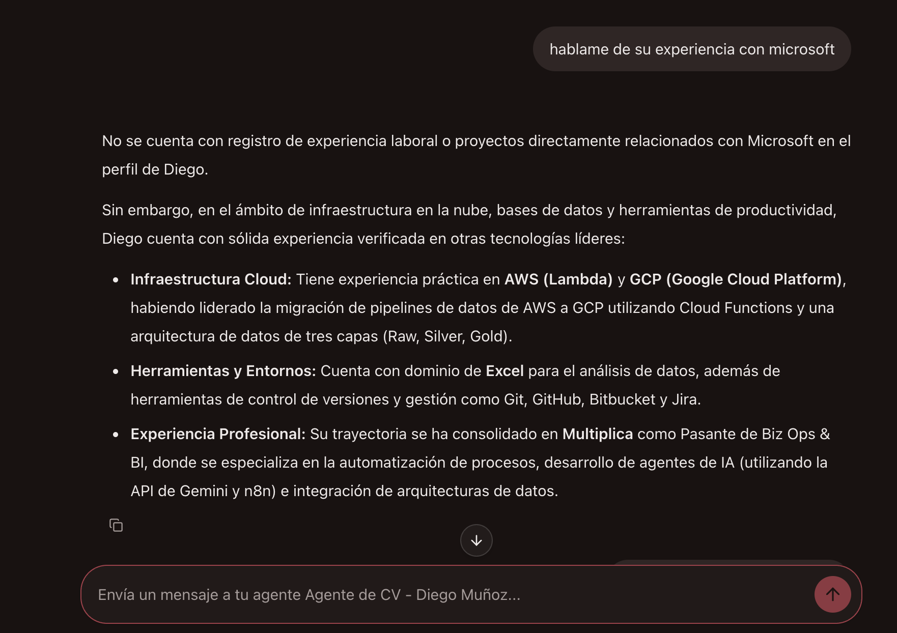
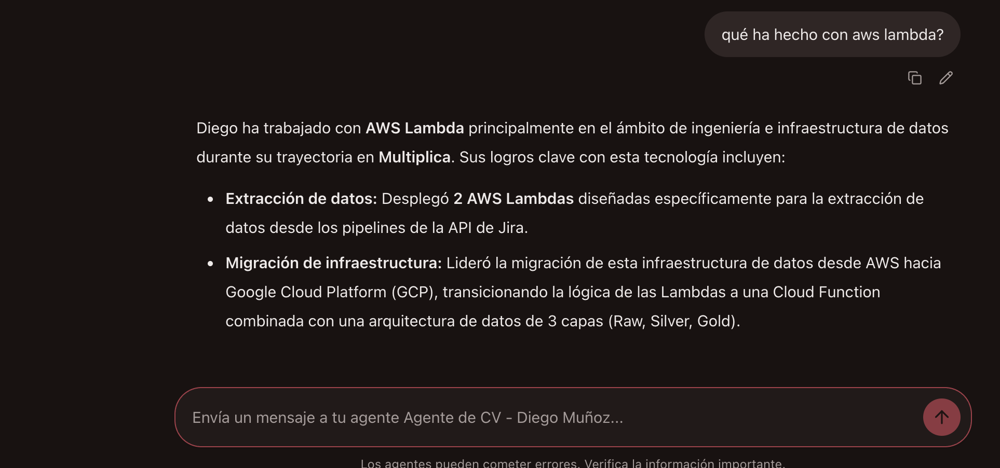

# Agente de CV (Reto IA Banorte)

Agente virtual inteligente diseñado específicamente para el **Reto IA Banorte**, optimizado para actuar como un experto representante de la trayectoria profesional, formación académica y proyectos de **Diego Muñoz (yo)**.

---

## Decisiones Técnicas y Arquitectura

La integración se diseñó bajo los siguientes pilares:

### 1. Diseño y Base de Conocimiento (Anti-Alucinaciones)

- **Estructura de Datos Local (`cv.json`):** Toda la información curricular se inyecta directamente como contexto estructurado en las instrucciones del sistema (`SYSTEM_INSTRUCTION`).
- **Reglas de Restricción Estrictas:** Se configuró un prompt con delimitadores XML rigurosos para prohibir suposiciones o deducciones lógicas. Si una tecnología o empresa no está listada literalmente en el contexto, el agente informa con neutralidad y redirige la conversación hacia la experiencia verificada de Diego en tercera persona.

### 2. Integración y Protocolo (Open Responses API)

- **Estandarización JSON:** El servicio implementa el protocolo _Open Responses_, asegurando que la respuesta devuelva estrictamente la ruta esperada por la plataforma (`output[0].content[0].text`) con bloques del tipo `output_text`.
- **Procesamiento de Mensajes:** Se implementó una lógica robusta en FastAPI para parsear dinámicamente las listas de mensajes anidados enviados por el frontend de Banorte.

### 3. Despliegue y Operación en la Nube (FastAPI + Render)

- **Framework de Alto Rendimiento:** Desarrollado en **FastAPI** para garantizar la velocidad de enrutamiento y la validación de esquemas mediante **Pydantic**.
- **Modelo de IA:** Integrado mediante la librería oficial `google-genai` utilizando el modelo `gemini-2.5-flash` para mantener baja latencia y alta estabilidad.
- **Optimización Asíncrona:** Las llamadas al modelo se ejecutan de manera asíncrona (`await client.aio.models.generate_content`) para evitar bloqueos del servidor y prevenir el rechazo por _Timeouts_ (>120s) comunes en pasarelas corporativas.
- **Hosting (Render):** Desplegado en un contenedor web en la nube con endpoints expuestos bajo el prefijo `/v1/responses`.

---

## Demostración y Evidencias de Ejecución

A continuación se muestran ejemplos reales del agente respondiendo en la plataforma de Banorte:

### 1. Consulta de Experiencia Laboral Reciente

_El agente detalla con precisión los logros en Multiplica utilizando formato en viñetas y negritas._

### 2. Resumen Ejecutivo del Perfil

_Presentación formal del perfil profesional de Diego._

### 3. Manejo de Restricciones

_Ejemplo donde se le cuestiona sobre tecnologías no registradas (como Microsoft), respondiendo con neutralidad y redirigiendo hacia su stack cloud real (AWS/GCP)._

### 4. Consultas Técnicas Específicas

_Respuesta detallada sobre proyectos en infraestructura cloud (AWS Lambda)._

---

## Endpoints Principales

- `GET /` — Comprobación de estado del agente ("Agente en línea").
- `POST /v1/responses` — Endpoint principal bajo la especificación _Open Responses_ que procesa las consultas del chat institucional de Banorte.
